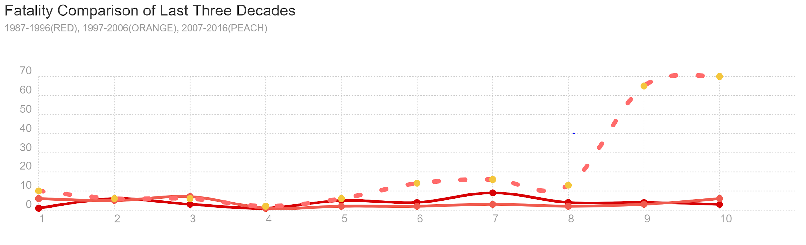

Need config.js file with Map Box API_KEY

**Mass Shootings in the U.S.**

** **

** **

**Project Decision Outline**

<table>
  <tr>
    <td>Project Purpose</td>
    <td>What this project is about and what it aims to accomplish?
We will analyze crime data, targeting the frequency of Mass Shootings throughout the US to identify trends across locations, mental-health of shooter, shooter demographic data, day of the week of shooting, and type of firearm used. Our project will compare three decades of data, 1987-1997, 1997-2007, and 2007-2017.</td>
  </tr>
  <tr>
    <td>The Need for this Project</td>
    <td>Explain the problem that the project addresses specifically.
This project will address the frequency of mass shootings in the US and analyze the following statistical data: the states with the most frequent occurrence, types of locations the shootings most often occur, shooter-race, average shooter-age, day of the week most shootings occur, and the percentage of shooters that have a documented mental-illness. </td>
  </tr>
  <tr>
    <td>Evidence</td>
    <td>What evidence is there to support the need for this project?
The staggering number of over 300 mass shootings that have occurred within the last 30 years here in the US. 
</td>
  </tr>
</table>

 		 

**Data Sets to be Used:**

** **

<table>
  <tr>
    <td> Url = 
https://public.opendatasoft.com/api/records/1.0/search/?dataset=mass-shootings-in-america&rows=1000&facet=city&facet=state&facet=shooter_sex&facet=shooter_race&facet=type_of_gun_general&facet=fate_of_shooter_at_the_scene&facet=shooter_s_cause_of_death&facet=school_related&facet=place_type&facet=relationship_to_incident_location&facet=targeted_victim_s_general&facet=possible_motive_general&facet=history_of_mental_illness_general&facet=military_experience
</td>
  </tr>
</table>

 

**Rough Breakdown of Tasks:**

* Project Manager

* Extracted API mass shooting data and load data in MongoDB database

* Pull data from MongoDB to create mapping of locations for additional analysis

* Developed dashboard for presentation visualization

* Researching new JS library not previously learned in class (Chartist)

* Created Powerpoint for group presentation

* Development of Visualizations 

                     		

* Researching state policy data for additional analysis

* Import, clean, analyzed statistical data from API

* Development of Visualizations 

		

